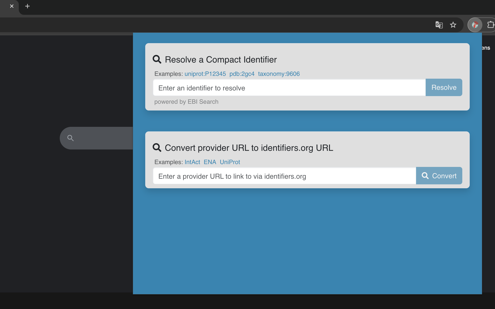
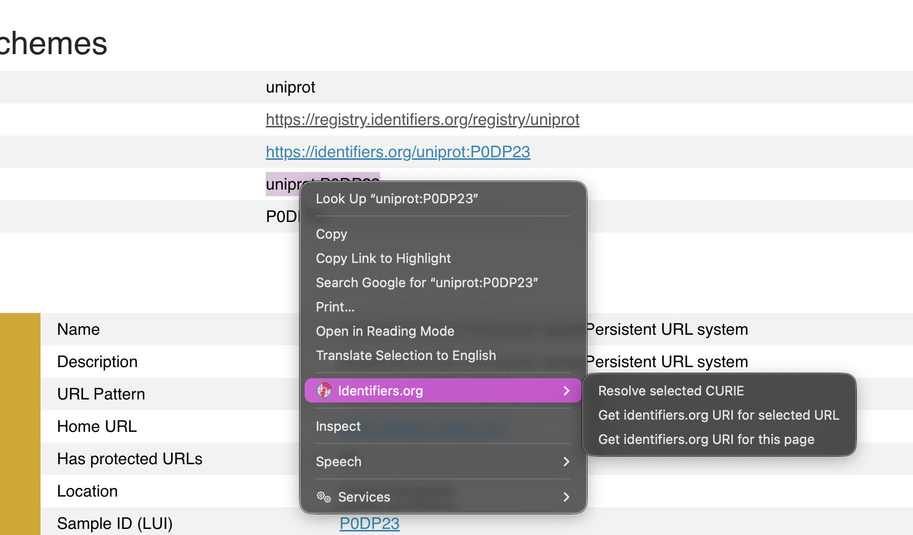

# Browser extension for identifiers.org

This browser extension aims at facilitating workflows that use identifiers.org URIs. Both Firefox and Google Chrome are supported.

> [!IMPORTANT]
> This extension is currently a work in progress.

## Features

Two main feature groups are available, the embedded search bars and the action menu actions.

### Embeded search bars

The current search bars are available from the extension menu at the [identifiers.org homepage](http://identifiers.org) for easy access. These work in the same was as in the homepage.

### Context menu actions

These are available by right-clicking selected text, links and web pages. 

The three actions available are:

#### Resolve selected CURIE
By selecting a CURIE string on any page, users can go to the URL resolved by our resolution services.

#### Get identifiers.org URI for selected URL
By right-clicking a link or selecting a URL as text, an identifiers.org URI can be generated for it if it is in our registry.

#### Get identifiers.org URI for this page
By right-clicking any page, an identifiers.org URI can be generated for it if it is in our registry.

### Compilation
To generate zipped files with the extension files for the two browsers use `npm run build:all`. Make sure you run `npm install` first.

### Instalation
While this is work in progress, please use Firefox's or Chrome's extension debugging features.
- [Load extension-firefox.zip as a temporary add-on on Firefox](https://extensionworkshop.com/documentation/develop/temporary-installation-in-firefox/)
- [Unpack extension-chrome.zip and install them Google Chrome extension developer mode](https://bashvlas.com/blog/install-chrome-extension-in-developer-mode)
